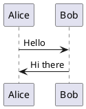
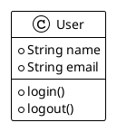

# UML Images Service

Веб-сервис для генерации диаграмм из PlantUML кода с микросервисной архитектурой.

## Архитектура

Система состоит из 3 микросервисов:

1. **API Service** (порт 9001) - REST API для генерации диаграмм
2. **UI Service** (порт 9002) - веб-интерфейс для работы с UML кодом
3. **Kroki Service** (порт 8001) - движок рендеринга PlantUML

## Технологии

- Node.js & Express
- Docker & Docker Compose
- Vanilla JavaScript (без фреймворков)
- PlantUML через Kroki

## Запуск

### Разработка (Development режим)

```bash
# Запуск всех сервисов
npm run dev

# Остановка сервисов
npm run stop

# Просмотр логов
npm run logs

# Полная очистка (контейнеры, образы, volumes)
npm run clean
```

### Доступ к сервисам

- **UI Service**: http://localhost:9002
- **API Service**: http://localhost:9001
- **Kroki Service**: http://localhost:8001

### Health Check URLs

- API Service: http://localhost:9001/health
- UI Service: http://localhost:9002/health
- Kroki Service: http://localhost:8001/health

## API Endpoints

### POST /api/v1/generate

Генерация PNG диаграммы из PlantUML кода.

**Request:**
```json
{
  "uml": "@startuml\nAlice -> Bob: Hello\n@enduml"
}
```

**Response:**
- Success: PNG image (binary)
- Error: JSON с описанием ошибки

## Примеры PlantUML кода





## 🛡️ Безопасность

Сервис включает комплексные меры безопасности:

### Ключевые функции безопасности
- ✅ **Защита от RCE**: Kroki запущен в безопасном режиме
- ✅ **Валидация входных данных**: Блокировка опасных PlantUML паттернов  
- ✅ **Rate limiting**: Ограничение запросов по IP
- ✅ **CORS защита**: Настроенная политика источников
- ✅ **Безопасность контейнеров**: Непривилегированные пользователи
- ✅ **Security headers**: CSP, HSTS, X-Frame-Options и др.
- ✅ **Мониторинг безопасности**: Логирование подозрительной активности

### Безопасный запуск (Production)

```bash
# Развертывание с production настройками безопасности
./scripts/secure-deploy.sh --environment production

# Тестирование безопасности
./scripts/security-test.sh

# Мониторинг безопасности
./scripts/security-monitor.sh --continuous
```

### Документация безопасности
Подробная информация о мерах безопасности: [SECURITY.md](SECURITY.md)

## Структура проекта

```
uml-images-service/
├── api-service/              # API микросервис
│   ├── middleware/           # Middleware безопасности
│   ├── utils/               # Утилиты логирования
│   └── logs/                # Логи безопасности
├── ui-service/              # UI микросервис
├── scripts/                 # Скрипты безопасности
│   ├── secure-deploy.sh     # Безопасное развертывание
│   ├── security-test.sh     # Тестирование безопасности
│   └── security-monitor.sh  # Мониторинг безопасности
├── docker-compose.yml       # Базовая конфигурация
├── docker-compose.prod.yml  # Production конфигурация
├── SECURITY.md             # Документация безопасности
└── README.md               # Документация
```