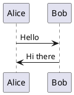
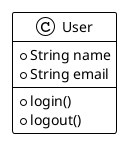

# UML Images Service

Web service for generating diagrams from PlantUML code with microservice architecture.


## Architecture

The system consists of 3 microservices:

1. **API Service** (port 9001) - REST API for diagram generation
2. **UI Service** (port 9002) - web interface for working with UML code
3. **Kroki Service** (port 8001) - PlantUML rendering engine

## Technologies

- Node.js & Express
- Docker & Docker Compose
- Vanilla JavaScript (no frameworks)
- PlantUML via Kroki

## Running

### Development mode

```bash
# Start all services
npm run dev

# Stop services
npm run stop

# View logs
npm run logs

# Complete cleanup (containers, images, volumes)
npm run clean
```

### Service Access

- **UI Service**: http://localhost:9002
- **API Service**: http://localhost:9001
- **Kroki Service**: http://localhost:8001

### Health Check URLs

- API Service: http://localhost:9001/health
- UI Service: http://localhost:9002/health
- Kroki Service: http://localhost:8001/health

## API Endpoints

### POST /api/v1/generate

Generate PNG diagram from PlantUML code.

**Request:**
```json
{
  "uml": "@startuml\nAlice -> Bob: Hello\n@enduml"
}
```

**Response:**
- Success: PNG image (binary)
- Error: JSON with error description

## PlantUML Code Examples





## 🛡️ Security

The service includes comprehensive security measures:

### Key Security Features
- ✅ **RCE Protection**: Kroki runs in secure mode
- ✅ **Input Validation**: Blocks dangerous PlantUML patterns  
- ✅ **Rate limiting**: Request limiting by IP
- ✅ **CORS Protection**: Configured origin policy
- ✅ **Container Security**: Non-privileged users
- ✅ **Security headers**: CSP, HSTS, X-Frame-Options, etc.
- ✅ **Security Monitoring**: Suspicious activity logging

### Secure Launch (Production)

```bash
# Deploy with production security settings
./scripts/secure-deploy.sh --environment production

# Security testing
./scripts/security-test.sh

# Security monitoring
./scripts/security-monitor.sh --continuous
```

### Security Documentation
Detailed information about security measures: [SECURITY.md](SECURITY.md)

## Project Structure

```
uml-images-service/
├── api-service/              # API microservice
│   ├── middleware/           # Security middleware
│   ├── utils/               # Logging utilities
│   └── logs/                # Security logs
├── ui-service/              # UI microservice
├── scripts/                 # Security scripts
│   ├── secure-deploy.sh     # Secure deployment
│   ├── security-test.sh     # Security testing
│   └── security-monitor.sh  # Security monitoring
├── docker-compose.yml       # Base configuration
├── docker-compose.prod.yml  # Production configuration
├── SECURITY.md             # Security documentation
└── README.md               # Documentation
```